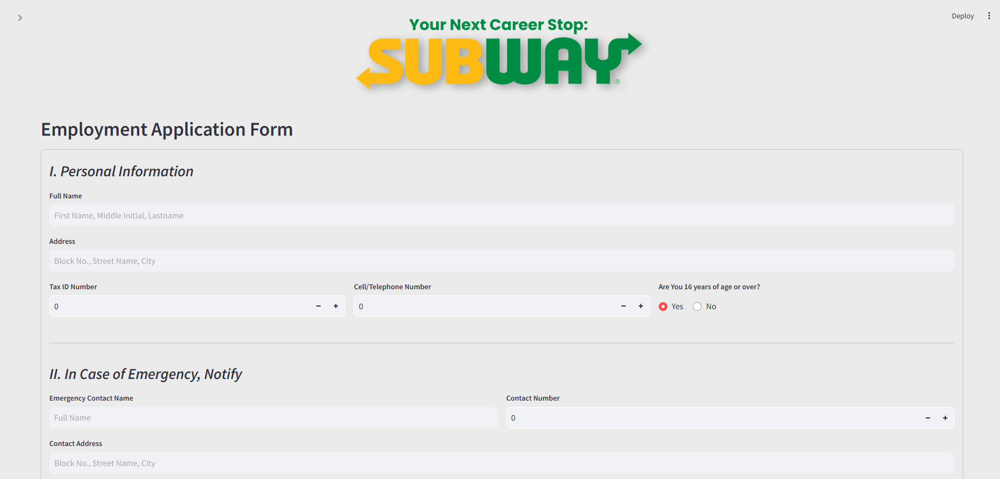
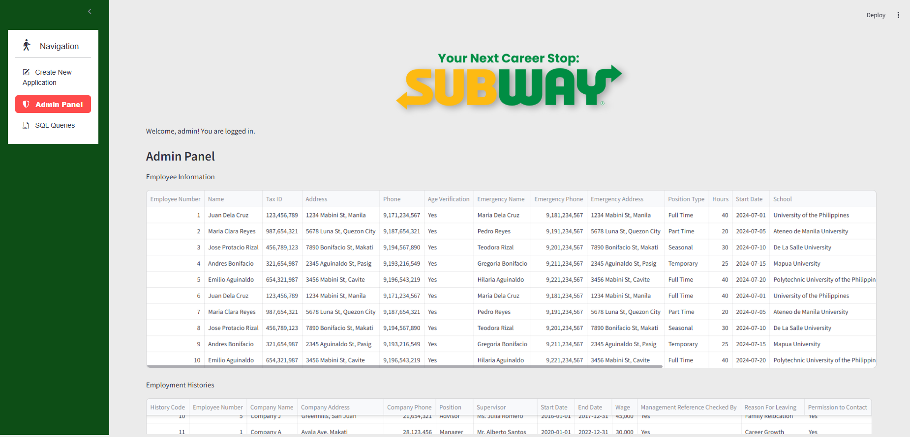

# Subway Employment Application Management System

A web-based employment application management system built with Streamlit for Subway franchise operations. This application allows job seekers to submit employment applications and administrators to manage applicant data.

## Features

### 1. Create New Application

Applicants can fill out a comprehensive employment application form including:
- **Personal Information**: Name, Tax ID, address, phone number, age verification
- **Emergency Contact**: Contact name, phone, and address
- **Availability**: Position type (Part Time, Full Time, Seasonal, Temporary), hours per week, start date
- **Education**: School information, GWA, grade completed, graduation and enrollment status
- **Employment History**: Previous work experience with company details, supervisor, wages, and reason for leaving
- **References**: Personal/professional references with contact information

### 2. Admin Panel

Secure admin access to manage all application data:
- View all applicant information in tabular format
- View employment histories and references
- Update applicant details
- Delete applicant records
- **Login credentials**: Username: `admin` | Password: `pass`

### 3. SQL Queries

Pre-built SQL queries for data analysis and reporting:
- Filter applicants by position type and qualifications
- Search by school, availability, and enrollment status
- Analyze employment history and wages
- Generate reference reports

## Tech Stack

- **Frontend**: [Streamlit](https://streamlit.io/) - Python web framework
- **Database**: SQLite - Lightweight relational database
- **UI Components**: streamlit-option-menu for navigation

## Installation

1. Clone or download the repository

2. Navigate to the project directory:
   ```bash
   cd infoman
   ```

3. Install dependencies:
   ```bash
   pip install streamlit streamlit-option-menu pandas
   ```

## Usage

1. Run the application:
   ```bash
   python -m streamlit run main.py
   ```

2. Open your browser and navigate to:
   ```
   http://localhost:8501
   ```

3. Use the sidebar navigation to:
   - **Create New Application**: Submit a new employment application
   - **Admin Panel**: Login as admin to manage applications
   - **SQL Queries**: Run pre-defined queries on the database

## Database Schema

The application uses three main tables:

### applicant_info
| Field | Type | Description |
|-------|------|-------------|
| emp_num | INTEGER | Primary Key (Auto-increment) |
| applicant_name | TEXT | Full name of applicant |
| tax_ID_num | INTEGER | Tax identification number |
| applicant_address | TEXT | Home address |
| applicant_tel_num | INTEGER | Phone number |
| age_verification | TEXT | Yes/No - 16 years or older |
| emergency_name | TEXT | Emergency contact name |
| emergency_tel_num | INTEGER | Emergency contact phone |
| emergency_address | TEXT | Emergency contact address |
| position_type | TEXT | Part Time/Full Time/Seasonal/Temporary |
| total_hours | INTEGER | Available hours per week |
| date_availability | DATE | Available start date |
| school_name | TEXT | Most recent school attended |
| school_address | TEXT | School address |
| school_tel_num | INTEGER | School phone number |
| counselor_name | TEXT | School counselor name |
| grade_completed | TEXT | Elementary/Junior High/Senior High/College |
| GWA | REAL | Grade weighted average |
| graduated | TEXT | Yes/No |
| enrolled | TEXT | Yes/No - Currently enrolled |

### employment_history
| Field | Type | Description |
|-------|------|-------------|
| history_code | INTEGER | Primary Key (Auto-increment) |
| emp_num | INTEGER | Foreign Key to applicant_info |
| company_name | TEXT | Previous employer name |
| company_address | TEXT | Company address |
| company_tel_num | INTEGER | Company phone |
| position | TEXT | Job position held |
| supervisor | TEXT | Supervisor name |
| date_worked_from | DATE | Start date |
| date_worked_to | DATE | End date |
| wage | INTEGER | Salary/wage |
| mgnt_ref_ck | TEXT | Management reference check |
| reason_for_leaving | TEXT | Reason for leaving |
| permission | TEXT | Yes/No - Permission to contact |

### reference
| Field | Type | Description |
|-------|------|-------------|
| ref_code | INTEGER | Primary Key (Auto-increment) |
| emp_num | INTEGER | Foreign Key to applicant_info |
| ref_name | TEXT | Reference name |
| ref_tel_num | INTEGER | Reference phone |
| years_known | INTEGER | Years known |
| ref_address | TEXT | Reference address |

## Project Structure

```
infoman/
├── main.py              # Main Streamlit application entry point
├── create_application.py # New application form component
├── admin_login.py       # Admin panel and authentication
├── db_functions.py      # Database operations (CRUD)
├── sql_queries.py       # Pre-defined SQL queries
├── dbquery.sql          # SQL reference file
├── requirements.txt     # Python dependencies
├── screenshots/         # Application screenshots
└── README.md            # This file
```

## License

This project was developed for educational purposes at the Polytechnic University of the Philippines.

---

*Built with Streamlit for Information Management course requirements.*
