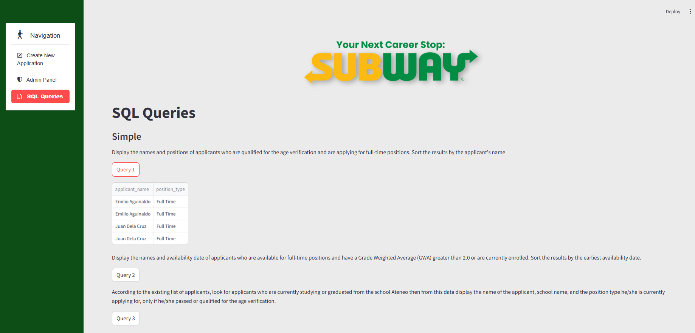

# Subway Employment Application Management System

A web-based employment application management system built with Streamlit for Subway franchise operations. This application allows job seekers to submit employment applications and administrators to manage applicant data.

## Features

### 1. Create New Application
Applicants can fill out a comprehensive employment application form including:
- **Personal Information**: Name, Tax ID, address, phone number, age verification
- **Emergency Contact**: Contact name, phone, and address
- **Availability**: Position type (Part Time, Full Time, Seasonal, Temporary), hours per week, start date
- **Education**: School information, GWA, grade completed, graduation and enrollment status
- **Employment History**: Previous work experience with company details, supervisor, wages, and reason for leaving
- **References**: Personal/professional references with contact information

### 2. Admin Panel
Secure admin access to manage all application data:
- View all applicant information in tabular format
- View employment histories and references
- Update applicant details
- Delete applicant records

### 3. SQL Queries
Pre-built SQL queries for data analysis and reporting:
- Filter applicants by position type and qualifications
- Search by school, availability, and enrollment status
- Analyze employment history and wages
- Generate reference reports

## Tech Stack

- **Frontend**: [Streamlit](https://streamlit.io/) - Python web framework
- **Database**: SQLite - Lightweight relational database
- **UI Components**: streamlit-option-menu for navigation

## Installation

1. Clone or download the repository

2. Navigate to the project directory:
   ```bash
   cd infoman
   ```

3. Install dependencies:
   ```bash
   pip install -r requirements.txt
   ```

## Configuration

### Setting Up Admin Credentials

This application uses Streamlit secrets for secure credential management.

1. Create the secrets file (already created at `.streamlit/secrets.toml`):
   ```toml
   # Admin credentials - DO NOT commit this file to version control
   username = "admin"
   password = "your_secure_password"
   ```

2. **IMPORTANT**: The `secrets.toml` file is already added to `.gitignore` to prevent accidental commits.

3. For deployment (e.g., Streamlit Cloud), add secrets through the platform's secrets management UI.

## Usage

1. Run the application:
   ```bash
   python -m streamlit run main.py
   ```

2. Open your browser and navigate to:
   ```
   http://localhost:8501
   ```

3. Use the sidebar navigation to:
   - **Create New Application**: Submit a new employment application
   - **Admin Panel**: Login as admin to manage applications
   - **SQL Queries**: Run pre-defined queries on the database

## Project Structure

```
infoman/
├── .streamlit/
│   └── secrets.toml     # Admin credentials (gitignored)
├── main.py              # Main Streamlit application entry point
├── create_application.py # New application form component
├── admin_login.py       # Admin panel and authentication
├── db_functions.py      # Database operations (CRUD)
├── sql_queries.py       # Pre-defined SQL queries
├── dbquery.sql          # SQL reference file
├── requirements.txt     # Python dependencies
├── screenshots/         # Application screenshots
└── README.md            # This file
```

## Screenshots

### Application Form


### Admin Login


### SQL Queries


## Security Notes

- Never commit `secrets.toml` to version control
- Change the default admin password before deploying
- The `.gitignore` file is configured to exclude sensitive files

## License

This project was developed for educational purposes at the Polytechnic University of the Philippines.

---

*Built with Streamlit for Information Management course requirements.*
